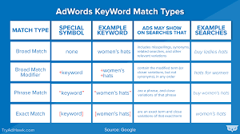

# Google PPC  - (Pay-Per-Click)

# Google Ads  [https://ads.google.com/)](https://ads.google.com/)  

  1. Search Audience  
  
  2. Display Audience  

# Ad run  
  Levels  
  1. Campaign  
    - **Search Network:**  
      - create website traffic (instead of Sales or Leads or any other option)  
      - provide campaign Type    
      - provide campaign name  
      - define target location  
      - Budget  
      - Biding  
      - minimum CPC (cost per click)         

  2. Ad Groups - People which you want to target (campaign can have multiple groups)  
      - provide keywords which will be required for searching and displaying your Ad  
      
  3. Ad Copies  
      - provide URL of link of landing page  
      - Define Heading H1, H2 and H3 text  
      - Define link path  
      - Brief about the Ad (provide small description)
  
  **Ad Extension**  
    - under campaign --> select "Ads & Extension"  
      - Sitelinks Extension   
      - Call Extension  
      - Callout extension  
      
  **Dynamic Ads**  
    - Following are the steps to create dynamic Ads:  
      - Create new campaign  
      - Select **Sales**  
      - select campaign type  --> search
      - campaign name  
      - select "Search network"  
      - define Budget  
      - under Dynamic Search Ads  
        - "Enable Dynamic Search for this campaign"        
      
      - Under Ads Group
        - enter group name
        - select categories
    
  **Types of Keywords**  
    
    
    - Broad Match Keywords  
      
      
    - Phrase Match Keywords  
      - 
      
    - Exact Match Keywords  
    
  **Quality Score**  
  
  **Ads Optimization**  
  
